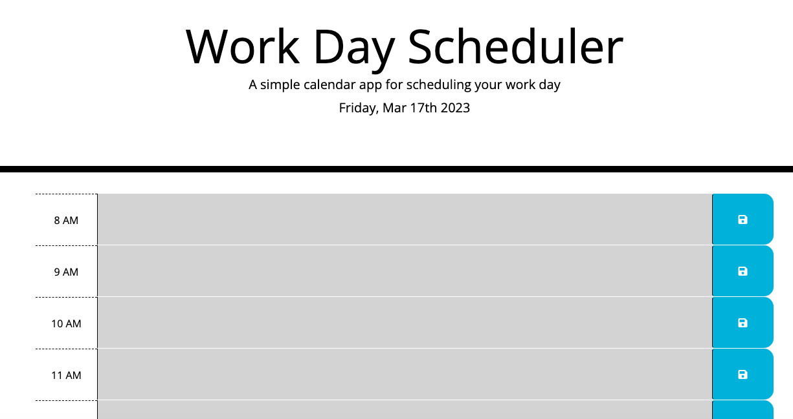
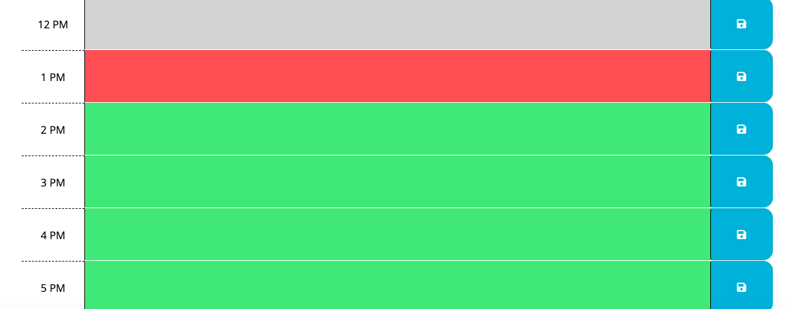

# README.md

## Description

A workday scheduler using moment.js

## Table of Contents

- [Installation](#installation)
- [Usage](#usage)
- [License](#license)
- [Contributing](#contributing)
- [Tests](#tests)
- [Questions](#questions)

## Installation

No

## Usage
https://cgeremia.github.io/workday-scheduler/

## License

https://opensource.org/licenses/MIT

## Contributing

No

## Tests

No

## Questions

My GitHub: https://github.com/cgeremia  
Email me: g_cristina@live.com

## Screenshot

